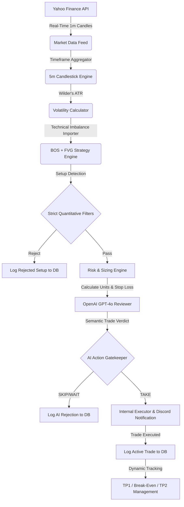

# Autonomous AI-Assisted Quantitative Trading System

[](https://tradingprogram-p3dzf9qeuejnw3yrj4ck2i.streamlit.app/)
[](https://www.python.org)
[](https://openai.com)

An autonomous quantitative trading pipeline designed to ingest real-time market data, dynamically identify structural inefficiencies (FVG + BOS), manage capital risk mathematically, and leverage Generative AI (GPT-4o) as an execution gatekeeper.

🚀 **Live Showcase Link**: [Launch Streamlit Portfolio Dashboard](https://tradingprogram-p3dzf9qeuejnw3yrj4ck2i.streamlit.app/)

---

## ⚡ Core Architecture

*   📈 **Real-Time Data Pipeline**: Ingests high-frequency market data using the **Yahoo Finance API (`yfinance`)** and dynamically resamples it for multi-timeframe analysis.
*   📐 **Quantitative Strategy Engine**: Programmatic detection of **Fair Value Gaps (FVGs)** and **Breaks of Structure (BOS)** using custom Wilder's ATR volatility algorithms.
*   🤖 **AI Execution Reviewer**: Integrates the **OpenAI API (GPT-4o)** to run context-aware qualitative checks on volume profile, trend context, and liquidity before validating trade execution.
*   🛡️ **Mathematical Risk Engine**: Calculates position sizes dynamically (e.g. 1% risk-to-capital rule), manages global exposure thresholds, and automates multi-stage exits (partial takes, trailing stops, and break-even trailing).
*   🖥️ **Analytics Dashboard**: Streamlit interface displaying real-time Plotly candlestick charts, localized timezone displays, and auto-seeded mock historical logs for instant recruiter presentation.

---

## 🛠️ Tech Stack

*   **Language**: Python 3.10+ (Fully compatible up to Python 3.14+)
*   **Libraries**: Streamlit, Plotly, Pandas, SQLAlchemy (SQLite), Pydantic v2, yfinance, OpenAI, Discord Webhooks

---

## 📊 System Flow



---

## 🔮 Machine Learning Roadmap

The SQLite logging system (`paper_trades.db`) was designed to build a labeled financial dataset. The next developmental phase involves:
1.  Collecting 1,000+ trade logs generated by the core scanning bot.
2.  Training a **Supervised Machine Learning Classifier** (e.g., XGBoost, Random Forest, or a Neural Network) using the logged metrics (volume ratio, FVG size, displacement, AI grade) as features and the trade outcome (`TP2_HIT` vs `STOPPED`) as labels.
3.  Replacing the heuristic strategy limits with the trained ML model to dynamically predict setup win probabilities before execution.

---


<details>
<summary><b>⚙️ Local Installation & Running Guide</b></summary>

### 1. Clone & Set Up Environment
```bash
git clone https://github.com/mikhail0777/TradingProgram.git
cd TradingProgram
python -m venv venv
```
*   **Windows (PowerShell)**: `.\venv\Scripts\Activate.ps1`
*   **Windows (CMD)**: `.\venv\Scripts\activate.bat`
*   **macOS/Linux**: `source venv/bin/activate`

### 2. Install Dependencies
```bash
pip install -r requirements.txt
```

### 3. Environment Configurations
Copy the `.env.example` file to `.env`:
```bash
cp .env.example .env
```
Open `.env` and fill in your keys (e.g., `OPENAI_API_KEY`, `DISCORD_WEBHOOK_URL`). If `USE_MOCK_AI=True` is kept, the bot will run using the deterministic mock reviewer without requiring an OpenAI key.

### 4. Running the System
*   **Start the Background Scanner Loop**:
    ```bash
    python bot.py
    ```
*   **Start the Analytics Web Dashboard**:
    ```bash
    python -m streamlit run trading_bot_ui.py
    ```
</details>

<details>
<summary><b>☁️ Production VPS Deployment Guide</b></summary>

The project is packaged with configuration templates for multi-environment cloud hosting, located in the `deploy/` directory:

### VPS Deployment (Ubuntu/Debian)
1. Copy the `deploy/` folder configurations to your VPS.
2. Run `sudo bash deploy/setup_vps.sh`. This automatically configures:
   *   **Systemd Daemons**: Manages both the trading bot and Streamlit UI as background linux services (`trading_bot.service`, `trading_dashboard.service`) that automatically restart on crashes or reboots.
   *   **Nginx Reverse Proxy**: Exposes the local port `8501` to standard ports `80/443` with WebSocket upgrade handling.
   *   **SSL Encrypted HTTPS**: Configures Let's Encrypt certificates automatically.
</details>

---

**Author**: [Mikhail Simanian](https://github.com/mikhail0777)
