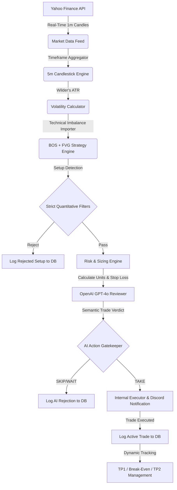

# Autonomous AI-Assisted Quantitative Trading System

An autonomous, multi-component quantitative trading system that detects technical market structures (FVG + BOS) using real-time data pipelines, applies rigorous mathematical risk management, and integrates Large Language Models (LLMs) to perform automated, context-aware secondary trade review.

This repository features both the **Core Background Trader Loop** and an **Interactive Analytics Dashboard** optimized for local deployment, VPS servers, or standalone free cloud hosting (Streamlit Community Cloud).

---

## 🚀 Architectural Highlights

This project was built to demonstrate proficiency in software engineering, quantitative finance, system architecture, and API integration. It consists of five major subsystems:

### 1. Real-Time Data Pipeline
*   **Engine**: Integrated with the **Yahoo Finance API (`yfinance`)** to ingest high-frequency market data.
*   **Timeframe Aggregator**: Fetches raw 1-minute candlestick data and aggregates it into 5-minute primary trading candles, computing real-time volatility metrics.

### 2. Quantitative Strategy Engine
*   **Fair Value Gaps (FVG)**: Programmatic detection of market inefficiencies (bullish and bearish imbalances) with custom-calculated Wilder's ATR thresholds to evaluate displacement candles.
*   **Breaks of Structure (BOS)**: Scans swing levels dynamically to identify structural direction changes on the chart.
*   **Pairing Scanner**: Uses an overlapping scanner that pairs recent structural breaks with open imbalance zones to identify high-probability entries.

### 3. Generative AI Risk Gatekeeper
*   **Semantic Analysis**: Integrates the **OpenAI API (GPT-4o)** as a secondary gatekeeper. The LLM evaluates technical metrics, session alignments, volume profiles, and trend context.
*   **JSON Schema Enforcement**: Leverages OpenAI's JSON mode to parse deterministic machine-readable evaluations (`TAKE`, `WAIT`, `SKIP`), grading trade quality (`A`, `B`, `C`, `F`) along with semantic explanations.
*   **Mock Fallback**: Includes a deterministic mock reviewer for testing environments without API cost overhead.

### 4. Mathematical Risk Engine
*   **Dynamic Sizing**: Computes position sizes dynamically based on a custom risk threshold (e.g., 1% capital risk per trade) and ATR stop-loss distance.
*   **Global Capital Controls**: Enforces safety limits including maximum daily losses, maximum open positions, and maximum notional capital exposure.
*   **Trade Management**: Implements automated multi-stage exits, including partial profits (TP1), trailing stops, and break-even trailing after TP1 is hit.

### 5. Streamlit Analytics & Visualization Dashboard
*   **Interactive Charting**: Implements custom **Plotly Candlestick Charts** overlaying detected FVG imbalance zones and BOS triggers in real-time.
*   **Auto-Localization**: Automatically converts database and chart timestamps from UTC to the user's localized timezone (e.g., Eastern Time).
*   **Standalone Portfolio Demo Mode**: The UI automatically initializes a blank database and seeds mock historical trades when deployed on cloud sandboxes, allowing hiring managers to preview the entire dashboard without needing a running background server.

---

## 🛠️ Tech Stack

*   **Language**: Python 3.10+ (Fully compatible up to Python 3.14+)
*   **Frameworks & Libraries**:
    *   **Frontend UI**: Streamlit, Plotly
    *   **Data Science**: Pandas, NumPy
    *   **Imbalance & Volatility**: Custom Wilder's Average True Range (ATR) algorithm
    *   **ORM & DB**: SQLAlchemy, SQLite
    *   **Validation**: Pydantic v2 (Pydantic Settings)
    *   **APIs**: yfinance, OpenAI, Discord Webhooks

---

## 📊 System Flow



---

## ⚙️ Setup & Local Installation

### 1. Clone & Set Up Environment
```bash
git clone https://github.com/mikhail0777/TradingProgram.git
cd TradingProgram
python -m venv venv
```
*   **Windows (PowerShell)**: `.\venv\Scripts\Activate.ps1`
*   **Windows (CMD)**: `.\venv\Scripts\activate.bat`
*   **macOS/Linux**: `source venv/bin/activate`

### 2. Install Dependencies
```bash
pip install -r requirements.txt
```

### 3. Environment Configurations
Copy the `.env.example` file to `.env`:
```bash
cp .env.example .env
```
Open `.env` and fill in your keys (e.g., `OPENAI_API_KEY`, `DISCORD_WEBHOOK_URL`). If `USE_MOCK_AI=True` is kept, the bot will run using the deterministic mock reviewer without requiring an OpenAI key.

### 4. Running the System
*   **Start the Background Scanner Loop**:
    ```bash
    python bot.py
    ```
*   **Start the Analytics Web Dashboard**:
    ```bash
    python -m streamlit run trading_bot_ui.py
    ```

---

## ☁️ Deployment Guides

The project is packaged with configuration templates for multi-environment cloud hosting, located in the `deploy/` directory:

### VPS Deployment (Ubuntu/Debian)
1. Copy the `deploy/` folder configurations to your VPS.
2. Run `sudo bash deploy/setup_vps.sh`. This automatically configures:
   *   **Systemd Daemons**: Manages both the trading bot and Streamlit UI as background linux services (`trading_bot.service`, `trading_dashboard.service`) that automatically restart on crashes or reboots.
   *   **Nginx Reverse Proxy**: Exposes the local port `8501` to standard ports `80/443` with WebSocket upgrade handling.
   *   **SSL Encrypted HTTPS**: Configures Let's Encrypt certificates automatically.

---

## 🔮 Future Machine Learning Roadmap

The SQLite logging system (`paper_trades.db`) was designed to build a labeled financial dataset. The next developmental phase involves:
1.  Collecting 1,000+ trade logs generated by the core scanning bot.
2.  Training a **Supervised Machine Learning Classifier** (e.g., XGBoost, Random Forest, or a Neural Network) using the logged metrics (volume ratio, FVG size, displacement, AI grade) as features and the trade outcome (`TP2_HIT` vs `STOPPED`) as labels.
3.  Replacing the heuristic strategy limits with the trained ML model to dynamically predict setup win probabilities before execution.

---

**Author**: [Mikhail Simanian](https://github.com/mikhail0777)
